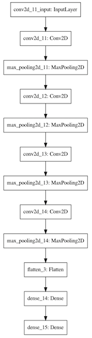
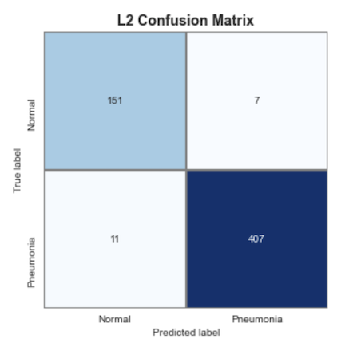

# Diagnosing Pneumonia using Machine Learning
---
By Cassie Nutter

## Description
This project aims to classify chest radiographs as being "normal" or having "pneumonia" present. Using machine learning and neural networks, the models attempt to learn and predict when pneumonia exists in an X-ray with an accuracy above 80% and having a false negative rate of <3%. 

_image from Unsplash_

## Background about Pneumonia

Pneumonia is an infection that inflames the air sacs in one or both lungs and can cause lungs to fill with fluid. This disease can be caused by many organisms, including bacteria, viruses and fungi. Combining multiple microbes that cause the disease with a way to spread them through coughing and sneezing makes pneumonia very contagious.

Pneumonia can be deadly to all, but is especially dangerous to older adults and children under five-years-old. Pneumonia is the leading cause of death worldwide for children under five. 

Treating pneumonia can be difficult, as well. Antibiotics work well for bacterial pneumonia but antibiotic resistance (germs develop an ability to defeat the drugs assigned to kill them) is becoming one of the biggest public health challenges to date.

There is a vaccine to prevent pneumonia, but other vaccines that prevent other diseases tend to work better. Vaccines for influenza, measles, and whooping cough (pertussis) can protect a person from the same bacteria and viruses that cause pneumonia.

## Data
---
Data was obtained from Kaggle site. Link for data can be found [here](https://www.kaggle.com/paultimothymooney/chest-xray-pneumonia).

The original dataset is also available, and is much larger. 
The dataset from Kaggle is partitioned into training, test, and validation folders, which are further separated into the target variables -- "Normal" or "Pneumonia". There are 5856 total images. 

The radiographs in each target variable are imbalanced with around 75% classified as "Pneumonia" and the other 25% as "Normal". The test set is slightly more balanced at about a two-thirds / one-third split with normal radiographs being the latter.

Below are examples of what the images look like in their original forms.

## Modeling
---

The images were rescaled and reshaped so the models could process them. The different models that were used are as follows:
* Baseline MLP
* MLP with dropout layers
* Baseline CNN
* CNN with augmentation
* CNN with dropout layers
* CNN with L2 regularization
* CNN model with VGG19 base layer

## Results
---

results df image

Some models stood out from others. All models were able to classify the x-ray images from the training and validation sets with an accuracy over 95%. However, when checking the models against the test data, we can see there was overfitting on some of the models, especially the baseline models.

The two models that were able to get above 80% accuracy with the test set were the CNN with augmentation and the CNN with dropout layers. 

Results from those two models are below:

**Augmented CNN**

**CNN with Dropout**

**L2 Model**

While this model was not as accurate as the other models, it is still worth mentioning. The accuracy was slightly lower than the CNN dropout model, but had fewer false negatives than other models. Reducing false negatives means that more patients with pneumonia are correctly identified. Here you can see the layers in the L2 model and the results.

 

  

## Interpretation
---
Three of the models 

