# Diagnosing Pneumonia using Machine Learning
---
By Cassie Nutter

## Description
This project aims to classify chest radiographs as being "normal" or having "pneumonia" present. Using machine learning and neural networks, the models attempt to learn and predict when pneumonia exists in an X-ray with an accuracy above 80% and having a false negative rate of <3%. 

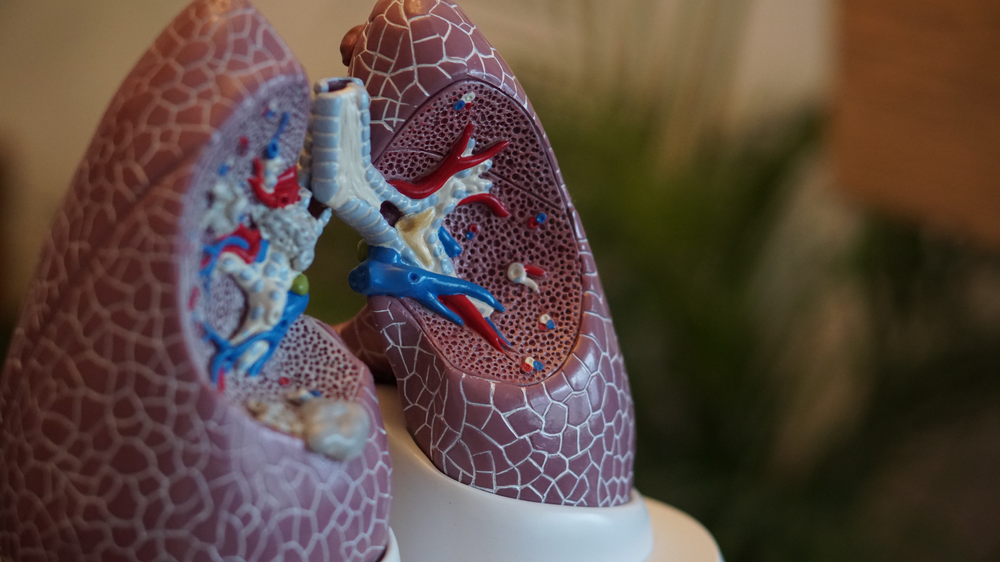

_image from Unsplash_

## Background about Pneumonia

Pneumonia is an infection that inflames the air sacs in one or both lungs and can cause lungs to fill with fluid. This disease can be caused by many organisms, including bacteria, viruses and fungi. Combining multiple microbes that cause the disease with a way to spread them through coughing and sneezing makes pneumonia very contagious.

Pneumonia can be deadly to all, but is especially dangerous to older adults and children under five-years-old. Pneumonia is the leading cause of death worldwide for children under five. 

Treating pneumonia can be difficult, as well. Antibiotics work well for bacterial pneumonia but antibiotic resistance (germs develop an ability to defeat the drugs assigned to kill them) is becoming one of the biggest public health challenges to date.

There is a vaccine to prevent pneumonia, but other vaccines that prevent other diseases tend to work better. Vaccines for influenza, measles, and whooping cough (pertussis) can protect a person from the same bacteria and viruses that cause pneumonia.

## Data
---
Data was obtained from Kaggle site. Link for data can be found [here](https://www.kaggle.com/paultimothymooney/chest-xray-pneumonia).

The original dataset is also available, and is much larger. 
The dataset from Kaggle is partitioned into training, test, and validation folders, which are further separated into the target variables -- "Normal" or "Pneumonia". There are 5856 total images. 

The radiographs in each target variable are imbalanced with around 75% classified as "Pneumonia" and the other 25% as "Normal". The test set is slightly more balanced at about a two-thirds / one-third split with normal radiographs being the latter.

Below are examples of what the images look like in their original forms.

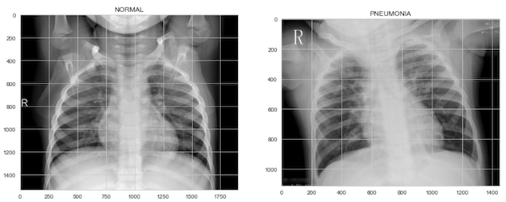

## What are Neural Networks and How do they Work?

Artificial neural networks, or neural networks are a kind of machine learning that replicates the way an animal brain learns, by using connected units or nodes that resemble neurons in a biological brain. Below is an example of a neural network using one hidden layer and having one output variable.

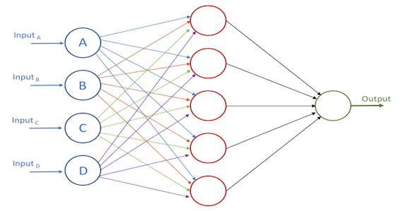

When training a neural network on images, the model will look for different patterns or edges. Below is an image that shows what the network is looking at in different layers. 

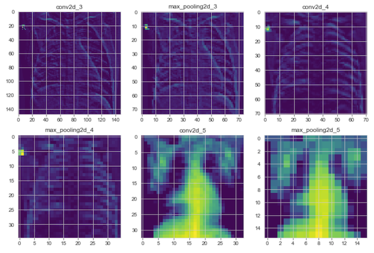

You can see that the computer's brain does not see the images the same way we do. 

Neural networks can be used not only on images, but other non-linear data like audio recordings and natural language processing. They can be used for classification or regression problems and once trained, make quick predictions.

## Modeling
---

The X-ray images were rescaled and reshaped so the models could process them. The different models that were built are as follows:

* Baseline MLP
* MLP with dropout layers
* Baseline CNN
* CNN with augmentation
* CNN with dropout layers
* CNN with L2 regularization
* CNN model with VGG19 base layer

Here is an example of the layers that were used in the CNN with dropout model.

The CNN with dropout layers model also contains class weights that try to correct the class imbalance.

Below is an image that shows the layers for the multilayer perceptron neural networks (MLP's)

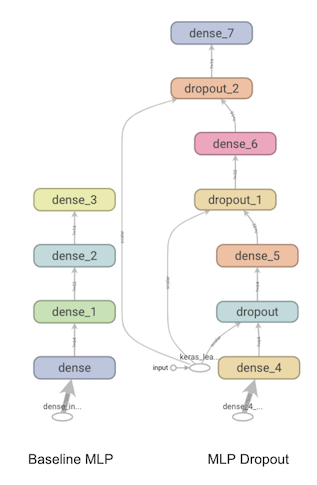

## Results
---

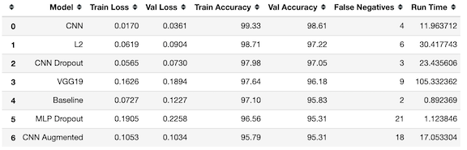

Some models stood out from others. All models were able to classify the x-ray images from the training and validation sets with an accuracy over 95%. However, when checking the models against the test data, we can see there was overfitting present, especially on the baseline models.

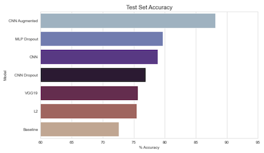

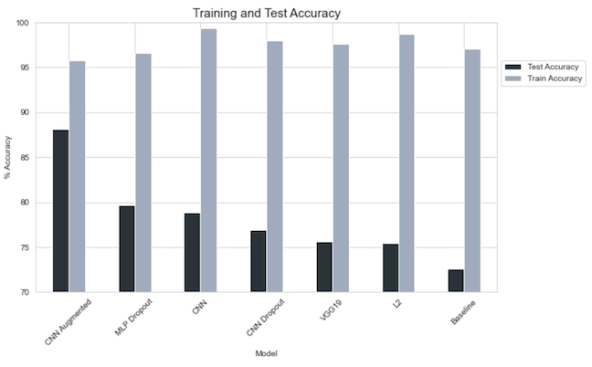

Above, you can see that which models had the highest accuracy compared to the training data and the test data. The augmented CNN had the lowest accuracy of all the models, yet was able to produce the highest accuracy when compared to the test data. This evidence shows that this model overfit the least.

**Accuracy is not everything.**

It is important to remember when looking at data, especially medical data, that accuracy does not tell the whole picture. It is also important to reduce the number of false negatives. False negatives in terms of our problem would be the model predicting the radiograph did not show signs of pneumonia when it actually did. This would potentially mean that a patient with pneumonia could be diagnosed as normal or healthy. 

Below are the results of false negatives from the training data and the test data.

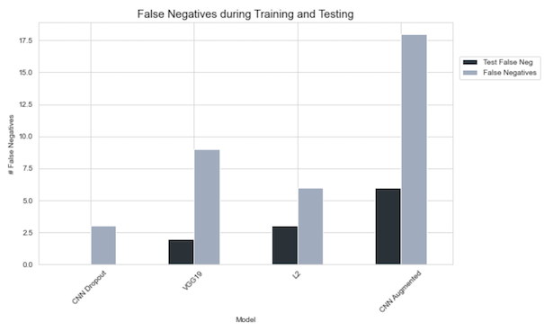

Your eyes do not deceive you. The CNN with dropout layers did not have any false negatives giving it a false positive rate of 0. 

**Computational Cost**

Another consideration when comparing models is the amount of time it takes to train them. Some models may perform just as well as other models, but train in a quarter of the time. Below, you'll see how long each model took to learn.

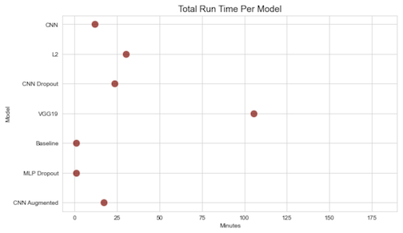

The models "VGG19" and "L2" are fairly comparable, yet the VGG19 model took over 1$\frac{1}{2}$ hours while the L2 model only took 30 minutes. It might be worthwhile to use the quicker model if both yield similar results.

## Conclusion

Due to it's high accuracy (88%) low false negative rate (1.6%) and reasonable computational cost (17 minutes), the best model that predicts pneumonia in X-rays is the augmented convolutional neural network.

Results from that model are below:

**Augmented CNN**

The CNN model with augmentation was not the most accurate of the models, it was also the model with the lowest false positive rate. While it did not have the lowest false negative rate (the CNN with dropout layers and adjusted class weights had 0%) it is very low at 1.6%. That rate equates to only 6 radiographs it incorrectly classified as not having pneumonia.

The next two images show the layers and parameters used to make the augmented model. The third images is the confusion matrix that resulted when the trained data was shown the unseen test data.

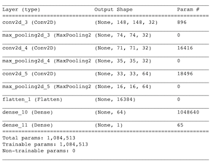

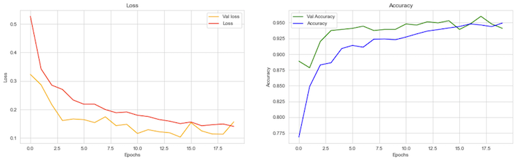

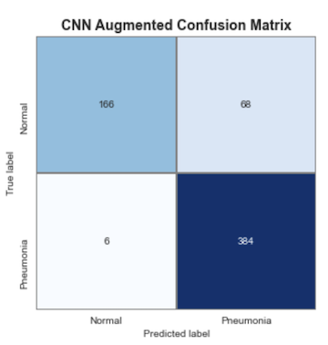

An augmented model reduces overfitting by artificially creating more training data from existing data. Here, we can see the original image and three augmented images the model used to help enable it's predictions.

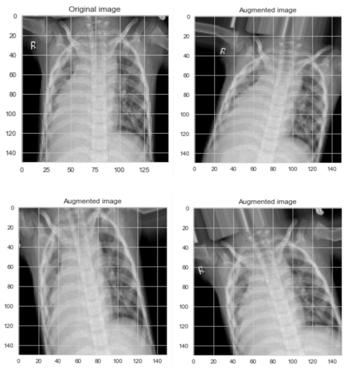

**Honorable Mentions**
Other viable options could include the CNN with dropout layers or the L2 model.

## Future Work

* Increase data : add more images from the original, much larger dataset. Adding more "normal" radiographs would be especially helpful for the model to better predict false positives as many of our models did not do great at this.
* COVID-19 : COVID-19 is an infectious respiratory illness, much like pneumonia. There is the potential that these models could help with the diagnosis of COVID-19 
* Transfer Learning : the VGG19 model used a set of pre-trained data to aid it's learning. There are other pre-trained networks that may improve predications
* Confirm diagnosis : the classification here were done after the radiographs were taken and patients were not present. It would have been interesting to have accompanying data, like CT scans, blood tests, and patient symptoms that further confirmed the classification of each X-ray.
